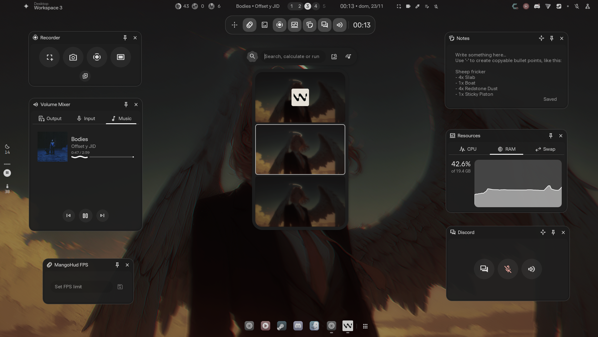
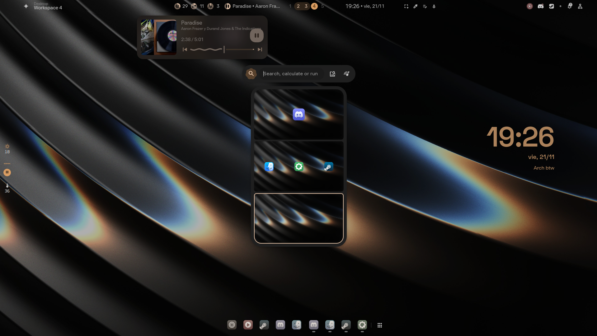
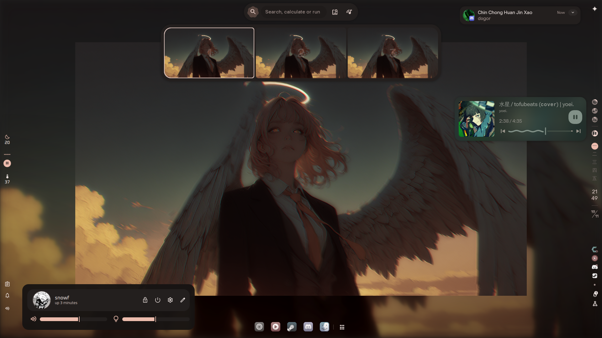

# illogical-impulse (ii) on Niri

This is my personal setup of **illogical-impulse (ii)** running on the **Niri** compositor.

Upstream ii by end-4 was written for Hyprland. I really like its UX and visuals, so I took the time to port it properly to Niri and then kept pushing it a lot further. This repo is that fork.

It’s not a generic “theme pack”. It’s my real config, the one I actually use every day, with:

- Deep integration with Niri (workspaces, windows, overview, layouts, keyboard layouts, DPMS).
- ii running **alongside** DankMaterialShell (DMS) on the same Niri session.
- A lot of small and big custom touches that the original ii doesn’t have.
- Plenty of things still in **WIP** that I’ll be iterating on over time.

Use it as inspiration, as a base to hack on, or just to see how ii can be pushed on Niri.

---

## Screenshots

All screenshots are taken from my actual Niri session with this config:

---

## What this setup does

Here’s the high‑level picture of what I’ve changed and added on top of upstream ii.

### 1. Proper Niri integration

- A central `CompositorService` detects the compositor and exposes flags like `isNiri`, `isHyprland`, `isGnome`.
- A dedicated `NiriService` talks to Niri through `NIRI_SOCKET` and keeps the important state available in QML:
  - Workspaces: `workspaces`, `allWorkspaces`, `currentOutputWorkspaces`.
  - Windows: `windows` plus an MRU list `mruWindowIds`.
  - Outputs and logical scales: `outputs`, `displayScales`, `currentOutput`.
  - Overview state: `inOverview`.
  - Keyboard layouts: `keyboardLayoutNames`, `currentKeyboardLayoutIndex`.
- It exposes native Niri actions for QML:
  - `toggleOverview`, `switchToWorkspace`, `focusWindow`, `moveWindowToWorkspace`, `closeWindow`.
  - DPMS helpers: `powerOffMonitors`, `powerOnMonitors`.

The idea is: instead of calling `niri msg` from random places, there’s a single, well‑behaved service that mirrors Niri’s state into QML and offers the actions as proper functions.

### 2. Niri‑specific overview

I keep the classic ii overview for Hyprland, but on Niri I use a separate implementation: `OverviewNiriWidget.qml`.

- It builds a grid of virtual workspaces using real Niri data:
  - Respects `Config.options.overview.rows`, `columns`, and `workspaceSpacing`.
  - Computes the “current slot” from `NiriService.getCurrentWorkspaceNumber()` and centers the visible window around it.
- Each workspace tile uses the real layout coming from Niri (scrolling layout + outputs).
- Windows are layed out inside each workspace using their `layout.pos_in_scrolling_layout`.
- Drag & drop between workspaces works by moving the window with Niri’s own indices.
- Scrolling the mouse wheel over the overview changes workspaces using Niri’s workspace numbers for the current output.
- Right‑click on a window tile opens a context panel:
  - Live preview via `ScreencopyView`.
  - Background uses the same wallpaper blur + dim settings as the overview itself.
  - Quick actions: focus or close the window through `NiriService`.

### 3. Custom Alt‑Tab (AltSwitcher) backed by Niri

The default Niri switcher is fine, but I wanted something closer to ii’s look and behavior.

- `modules/altSwitcher/AltSwitcher.qml` is a custom Alt‑Tab panel that slides in from the right.
- It is controlled by `GlobalStates.altSwitcherOpen` and is fully keyboard‑driven:
  - `Esc` closes it, `Enter` activates the current item, `↑/↓` or `J/K` move selection.
- It uses window data from `NiriService` and respects MRU order.
- Visual aspects are configurable through `Config.options.altSwitcher`:
  - Scrim opacity and dim.
  - Animation on/off and duration.
  - Monochrome vs full‑color icons, sharing the same pipeline as dock/workspaces.

### 4. Dynamic wallpaper blur/dim based on real Niri windows

I didn’t just add blur; I made it actually react to whether there are windows on the current workspace.

- `modules/background/Background.qml` detects “does this workspace actually have windows?” by:
  - For Niri: using `NiriService.workspaces` + `NiriService.windows` + `getCurrentWorkspaceNumber()`.
  - For Hyprland: using `HyprlandMonitor` and `HyprlandData.windowList`.
- It animates a `focusPresenceProgress` value from 0..1 when windows appear or disappear.
- That value controls:
  - Wallpaper blur, driven by `Config.options.background.effects.enableBlur` and `blurRadius`.
  - Extra dim on top of a base dim (`effects.dim` + `effects.dynamicDim`).
- The global wallpaper dim is completely decoupled from per‑widget dim (for example for the background clock). Widgets get their own `Config.options.background.widgets.<widget>.dim`.

### 5. Matugen + Material You theming shared with Niri

My colors don’t live in one place only; Matugen is the source of truth.

- `MaterialThemeLoader.qml` reads Matugen’s generated theme files under `~/.local/state/quickshell/user/generated/`.
- It fills `Appearance.m3colors` and friends and decides dark/light mode from the background lightness.
- `Wallpapers.qml` and the `scripts/colors/switchwall.sh` script are responsible for:
  - Changing the wallpaper.
  - Regenerating the theme with Matugen.
  - Synchronizing colors across ii, DMS, GTK, QT, and the files that Niri consumes.

Any new module that needs colors should use `Appearance.m3colors` or `Appearance.colors`, never parse theme files directly.

### 6. Global settings search with a dynamic index

I added a proper global search for Settings instead of hunting through pages.

- The search bar in `settings.qml` mirrors the visual style of the Overview search bar.
- `SettingsSearchRegistry.qml` collects all interesting options automatically:
  - `ConfigSwitch`, `ConfigSpinBox`, `ConfigSelectionArray`, etc. self‑register.
  - Each entry stores: page index/name, section, label, description, keywords, and a reference to the control.
- `buildResults(query)` builds a ranked list:
  - Filters by terms.
  - Sorts by page, section, and score.
- Results are shown in an overlay list with keyboard navigation (`↑/↓/Enter/Esc`).
- When you activate a result:
  - Settings jumps to the correct page.
  - Calls `focusFromSettingsSearch()` on the widget, which scrolls it into view, focuses it, and briefly highlights it.

### 7. Unified search bar pattern (Overview, Settings, future stuff)

Visually, I want search bars to feel the same across the shell.

- `modules/overview/SearchBar.qml` and the global Settings search bar share:
  - `MaterialShapeWrappedMaterialSymbol` for the icon.
  - `ToolbarTextField` with fixed compact height and small typography.
- When I add new search bars, I base them on this same pattern instead of reinventing the layout.

### 8. Integrated notepad

Sometimes I just want a small scratchpad that’s always around.

- `services/Notepad.qml` is a tiny singleton that persists text to `~/.local/state/quickshell/user/notepad.txt`.
- `modules/sidebarRight/notepad/NotepadWidget.qml` is the UI living in the right sidebar.
- There’s a button in the bar (`UtilButtons.qml`) that opens the right sidebar and selects the Notepad tab.
- Focus handling follows the standard sidebar focus pipeline so that the text area gets keyboard focus immediately.

### 9. Super tap → ii overview on Niri

The classic ii behavior of “tap Super to open overview” is preserved, but implemented in a way that doesn’t fight Niri.

- I handle the gesture in a separate daemon (`ii_super_overview_daemon.py`) plus a user systemd service.
- The daemon listens to evdev events from keyboard and mouse and only triggers when:
  - Super is pressed and released.
  - No other key or mouse button was pressed in between.
- When that happens, it runs:
  - `qs -c ii ipc call overview toggle`.
- On the QML side, the original `GlobalShortcut` logic from the Hyprland setup is kept for Hyprland only. On Niri, the daemon is the single source of truth for the Super tap gesture.

### 10. Niri workspaces wired into the bar

The workspace indicators in the bar are fully Niri‑aware.

- `modules/bar/Workspaces.qml` uses `NiriService.currentOutputWorkspaces` and `NiriService.getCurrentOutputWorkspaceNumbers()` to decide which slots are occupied.
- Scrolling over the workspace indicator area cycles workspaces for the current output, using Niri’s own 1‑based indices instead of emulating Hyprland behavior.

### 11. Keyboard layouts synced from Niri

I also tie keyboard layouts into ii so the shell reflects what Niri is actually using.

- `HyprlandXkb.qml` gained a `syncFromNiri()` code path:
  - Reads `NiriService.keyboardLayoutNames` and `NiriService.getCurrentKeyboardLayoutName()`.
  - Updates `layoutCodes` and `currentLayoutName` for the UI and on‑screen keyboard.
- The old Hyprland path (`hyprctl -j devices`) is still there for compatibility, but on Niri I rely on `NiriService`.

---

## How this differs from upstream ii (end‑4 / Hyprland)

This is **not** a 1:1 mirror of end‑4’s repo. The biggest differences are:

- **Native Niri support**
  - `CompositorService` knows about Niri via `NIRI_SOCKET` and exposes `isNiri`.
  - `NiriService` is brand new and replaces ad‑hoc `niri msg` calls in QML.
  - Existing modules are taught to branch on `CompositorService.isNiri` vs `isHyprland`.

- **A dedicated overview implementation for Niri**
  - `OverviewNiriWidget.qml` doesn’t exist upstream.
  - Workspace handling, drag & drop and the context panel are all written for Niri’s model.

- **Alt‑Tab (AltSwitcher) driven by Niri data**
  - Upstream ii uses Hyprland; here the AltSwitcher takes its data from `NiriService.windows` and Niri workspaces.
  - There’s a dedicated `Config.options.altSwitcher` section and a proper Settings page.

- **Dynamic blur/dim logic that understands Niri**
  - `Background.qml` knows about Niri’s workspaces and windows.
  - Dim depends on whether there are windows in the current workspace, not just on a global flag.

- **Global Settings search + unified search bars**
  - The whole `SettingsSearchRegistry` + overlay + auto‑scroll/highlight flow is my addition.

- **Integrated notepad service**
  - The Notepad service + widget + wiring in bar/sidebars don’t exist in upstream ii.

- **Super tap gesture moved out of the compositor**
  - Instead of relying on compositor keybinds, I use a small daemon + Quickshell IPC to implement “tap Super → toggle overview” on Niri without hijacking Super as a modifier.

In short: this is a fork of ii, not just a skin. It’s shaped specifically around Niri and my workflow.

---

## Requirements

This is what I actually run it with:

- **Compositor**: Niri 25.08 or newer.
- **Shell**: Quickshell ≥ 0.2.0.
- **Theming**: Matugen (for Material You style palettes and template generation).
- **Optional but recommended**:
  - DankMaterialShell (DMS) if you want to reproduce my hybrid setup.
  - Python + `python-evdev` for the Super tap daemon.

---

## Installation / usage notes

This repo is literally my live tree under `~/.config/quickshell/ii/`. I haven’t tried to turn it into a clean “one‑click install”. If you want to actually run it, I assume you’re comfortable with dotfiles and debugging your own Niri setup.

Rough outline:

1. Clone the repo or sync it as part of your dotfiles so it ends up at:
   - `~/.config/quickshell/ii/`
2. Make sure Niri, Quickshell and Matugen are all installed and working.
3. In your Niri config, start ii on login with something like:
   - `spawn-at-startup "qs" "-c" "ii"`
4. Start DMS separately if you want the hybrid ii + DMS shell combo.
5. Adjust any external scripts (`switchwall.sh`, the Super daemon, etc.) to match your paths.

If you’re only here to read QML and steal ideas, you can ignore all of this and just browse the code.

---

## Status

- The Niri integration (overview, workspaces, AltSwitcher, dynamic blur/dim, theming) is solid enough for daily use.
- A lot of pieces are still **work in progress** and I’m not afraid of breaking changes.
- I’ll keep updating this repo as I refine the Niri integration and add more features that make sense for my own workflow.
